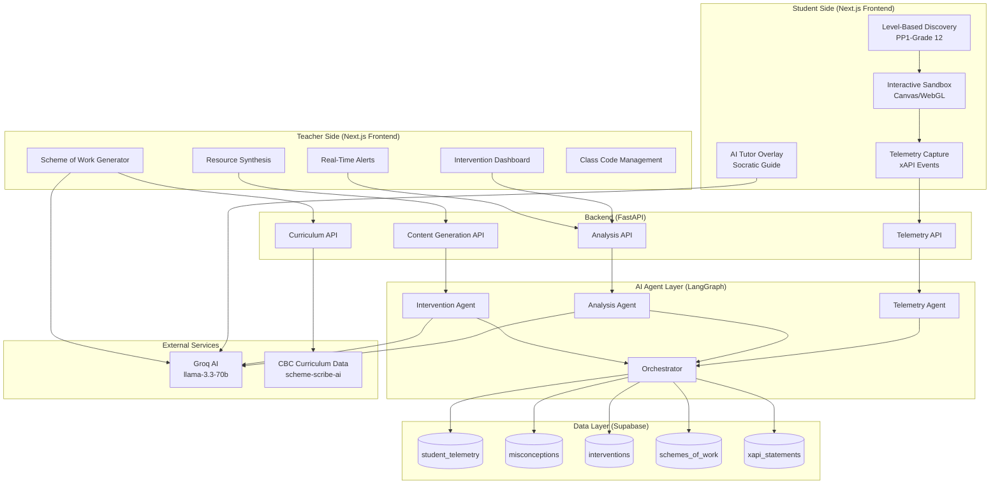

# Adaptive Learning Ecosystem - Design Document

## Overview

The Adaptive Learning Ecosystem transforms SyncSenta into an intelligent, data-driven educational platform that combines interactive student experiences with powerful teacher automation tools. The system captures rich behavioral telemetry from student interactions, analyzes this data using AI agents, and generates targeted interventions and content for teachers.

### Core Philosophy

- **Student-Centric**: Replace passive multiple-choice with active manipulation and exploration
- **Data-Driven**: Capture behavioral signals (dwell time, pathing, erasure rate) beyond correctness
- **Teacher-Empowering**: Automate differentiation, intervention generation, and content creation
- **Curriculum-Aligned**: Deep integration with CBC (Competency-Based Curriculum) standards
- **Zero-Cost**: Built on Groq (free), Vercel (free tier), and Supabase (free tier)

### Key Differentiators

| Feature | Traditional LMS | Adaptive Learning Ecosystem |
|---------|----------------|----------------------------|
| Student Interaction | Multiple choice | Interactive sandbox (Canvas/WebGL) |
| Data Captured | isCorrect: true/false | Dwell time, pathing, erasure rate, tool usage |
| Teacher Workflow | Manual lesson planning | AI-generated schemes of work → lesson plans |
| Intervention | Generic remediation | Targeted mini-lessons based on misconceptions |
| Curriculum | Generic standards | Deep CBC integration with KICD data |

## Architecture

### System Components



### Data Flow

**Student Interaction Flow:**
1. Student logs in → Level-based discovery (PP1-Grade 12)
2. Selects activity → Interactive sandbox loads (Canvas/WebGL)
3. Manipulates objects → Telemetry captured (dwell time, pathing, erasure)
4. xAPI statements generated → Stored in Supabase
5. AI Tutor analyzes behavior → Asks Socratic questions
6. Telemetry Agent processes data → Sends to Analysis Agent

**Teacher Intervention Flow:**
1. Analysis Agent identifies misconception → Creates misconception record
2. Intervention Agent generates content → Mini-lesson, rubric, worksheet
3. Real-time alert sent to teacher → Dashboard updates
4. Teacher reviews intervention → Approves/modifies
5. Content delivered to students → Tracked in interventions table

**Scheme of Work Flow:**
1. Teacher selects Grade, Subject, Term
2. Curriculum API fetches CBC data → scheme-scribe-ai integration
3. Content Generation API calls Groq → Generates 13-week scheme
4. Teacher reviews/edits → Saves to schemes_of_work table
5. System generates lesson plans → One per week from scheme

## Components and Interfaces

### Frontend Components (Next.js)

#### Student Side Components

**1. InteractiveSandbox Component**
```typescript
interface InteractiveSandboxProps {
  activityType: 'math' | 'science' | 'language' | 'physics';
  grade: string;
  subject: string;
  competency: string;
  onTelemetryEvent: (event: TelemetryEvent) => void;
}

interface TelemetryEvent {
  eventType: 'click' | 'drag' | 'drop' | 'hover' | 'erase' | 'tool_use';
  timestamp: number;
  position: { x: number; y: number };
  objectId?: string;
  toolId?: string;
  metadata: Record<string, any>;
}

// Renders Canvas/WebGL interactive playground
// Captures all user interactions
// Emits telemetry events in real-time
```

**2. TelemetryCapture Component**
```typescript
interface TelemetryCapture