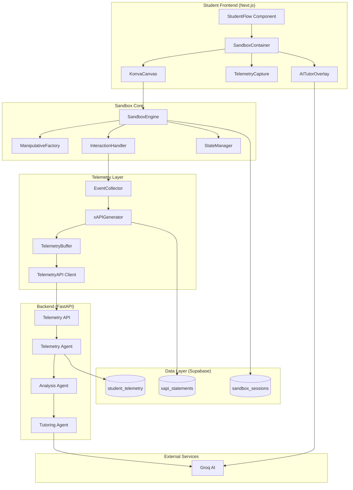

# Design Document: Interactive Sandbox

## Overview

The Interactive Sandbox is a Canvas-based interactive learning environment that replaces passive multiple-choice assessments with active manipulation and exploration. Students interact with mathematical objects (fraction bars, number lines, geometry tools) while the system captures rich behavioral telemetry (dwell time, pathing, erasure rate, tool usage) to enable AI-driven personalized feedback and teacher interventions. Built with Konva.js for 2D manipulatives, the sandbox integrates seamlessly with the existing MeTTa student flow (Grade → Subject → Activity) and supports mobile touch interactions with culturally relevant Kenyan context examples.

## Architecture

### System Overview



### Data Flow Sequence

```mermaid
sequenceDiagram
    participant Student
    participant Canvas
    participant TelemetryCapture
    participant Backend
    participant AITutor
    participant Database
    
    Student->>Canvas: Interact with manipulative
    Canvas->>TelemetryCapture: Emit interaction event
    TelemetryCapture->>TelemetryCapture: Calculate dwell time, pathing
    TelemetryCapture->>Backend: Send xAPI statement (batched)
    Backend->>Database: Store telemetry
    Backend->>Backend: Analyze behavior patterns
    Backend->>AITutor: Generate Socratic question
    AITutor-->>Student: Display contextual prompt
    Student->>AITutor: Respond to question
    AITutor->>Backend: Process response
    Backend->>Database: Update session state
